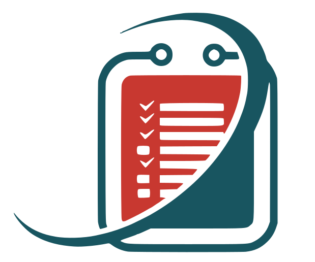
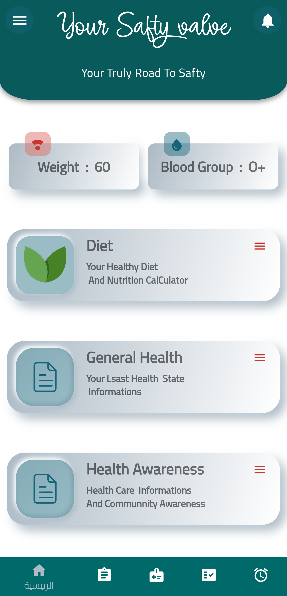

# Your Safty Valve
## Medical Records Project 

#### Proposal for Launch:

#### Proposal for Launch: Patient Health Record Management Application for the Yemeni Healthcare System

#### Project Overview:
   This proposal presents a **Patient Health Record Management Application** as part of a comprehensive healthcare management system aimed at enhancing patient care across hospitals and healthcare centers in the Republic of Yemen. Proposed to the Ministry of Health for potential launch, this patient-centered application is designed to organize and manage individual health records, providing a continuous medical history. By enhancing care coordination and promoting healthy lifestyle choices, this application aims to improve the quality, accessibility, and safety of healthcare.
#### Objectives and Key Features:

1. ##### Comprehensive Health Record Management:
   - Patients gain access to a secure platform for storing health records, ensuring continuity and accessibility of medical histories.
   - Healthcare providers can leverage these detailed patient histories for more personalized and informed care.

2. ##### Medication Management with Advanced Reminder System:
   - The app includes a medication reminder feature, promoting adherence to prescribed schedules and reducing risks associated with missed doses or incorrect medication usage.
   - This system helps prevent non-prescription drug use, prioritizing patient safety and ensuring treatments are properly followed.

3. ##### Diet and Nutrition Management:
   - Patients can customize dietary plans based on their medical records and preferences, creating meal plans tailored to health conditions.
   - This structured approach to nutrition is especially beneficial for managing chronic conditions.

4. ##### Appointment, Reservation, and Test Result Management:
   - Patients can make medical reservations, manage appointments, and choose suitable healthcare centers, improving accessibility to care.
   - A tracking feature enables users to monitor their health status, follow the life cycle of diseases (from diagnosis and treatment booking through to recovery), and check attendance for scheduled tests.
   - Patients can also access test results online and track the status of pending results as soon as they become available. Once confirmed, test results are automatically added to the patient's current medical record, ensuring a comprehensive, up-to-date health profile.

5. ##### Drug and Health Product Research Tool:
   - The app provides a medical search engine, allowing users to find detailed information on registered drugs from the Yemeni General Authority for Food and Drug Administration.
   - Users can also search for information on manufacturers, commercial agents, and companies, offering transparent and accessible information on healthcare products.

6. ##### Financial Tracking and Purchase Status:
   - Patients can monitor medication purchase statuses, which helps in managing ongoing treatment costs.
   - The app also enables users to track payment statuses for reservations, lab tests, and medical prescriptions, facilitating financial planning.

7. ##### Community Health Awareness and Preventative Care:
   - The app provides targeted health education, particularly beneficial for groups such as pregnant women, breastfeeding mothers, and individuals with chronic illnesses.
   - Based on stored medical data, the app offers health advice and awareness campaigns, encouraging proactive health practices.

8.   ##### Future Expansion Possibilities:
   - Planned features include emergency service integration, allowing patients to request ambulances or contact emergency responders directly.
   - Additional features could include a reporting system for illegal or unregistered drugs, ensuring a safer pharmaceutical environment.
   - Personalized health plans based on a user’s medical history and preferences are also anticipated, supporting a preventive approach to healthcare.
#### Technical Overview:
   Developed using **Flutter**, **MySQL**, and **Node.js**, the application is cross-platform compatible. PHP-based APIs enable seamless integration with healthcare systems, making it a secure, scalable, and open-source solution.
#### Proposal for Ministry Launch and Integration:
   This application is proposed for Ministry of Health launch, available as a free and secure, open-source tool accessible to all Yemeni citizens. We recommend that hospitals, clinics, and laboratories adopt compatible systems and connect with this application through a dedicated API, creating a unified healthcare ecosystem for Yemen.
#### Future Vision:
   This application represents the first phase of a larger open-source health ecosystem tailored to the Yemeni healthcare system. The ecosystem will grow through interconnected tools, creating a unified and resilient healthcare infrastructure for the nation.

[Link to the integrated health system feasibility study](https://github.com/Yemen-Health-Care/OrganizationVision)

---

#### اقتراح لإطلاق تطبيق إدارة السجلات الصحية للمرضى ضمن النظام الصحي اليمني 

#### نظرة عامة على المشروع:
   يهدف هذا الاقتراح إلى تقديم **تطبيق إدارة السجلات الصحية للمرضى** كجزء من نظام متكامل لإدارة الرعاية الصحية لتحسين جودة الرعاية الصحية في المستشفيات والمراكز الصحية في الجمهورية اليمنية. ويُقترح تقديمه لوزارة الصحة لإطلاقه، حيث يوفر التطبيق تنظيمًا وإدارةً للسجلات الصحية الفردية، من الولادة (أو بدء المشروع) وحتى نهاية حياة المريض، مما يسهم في خلق سجل طبي متواصل. ويعزز هذا التطبيق التنسيق في الرعاية الصحية ويشجع على خيارات نمط حياة صحية، مع تحسين جودة، وسهولة، وأمان الرعاية الصحية.

#### الأهداف والميزات الرئيسية:

1. ##### إدارة شاملة للسجلات الصحية:
   - يحصل المرضى على منصة آمنة لتخزين سجلاتهم الصحية، مما يضمن استمرارية وسهولة الوصول إلى المعلومات الطبية.
   - يتمكن مقدمو الرعاية الصحية من استخدام هذه السجلات المفصلة لتقديم رعاية شخصية وواعية، مما يعزز نتائج العلاج.

2. ##### إدارة الحجوزات والمتابعة لنتائج الفحوصات الطبية:
   - يتيح التطبيق للمرضى إمكانية حجز مواعيد طبية وإدارة جدول المواعيد، مع إمكانية اختيار المرافق الصحية المناسبة، مما يسهل الوصول إلى الرعاية الصحية.
   - يوفر التطبيق إمكانية متابعة الحالة الصحية ومراقبة دورة المرض (من التشخيص إلى الحجز للعلاج ومتابعة التحسن حتى الشفاء) وتسجيل الحضور للفحوصات المجدولة.
   - يمكن للمرضى الحصول على نتائج الفحوصات الطبية عبر الإنترنت وتتبع حالة النتائج فور ظهورها. ويتم تحديث السجل الطبي للمريض تلقائيًا بإضافة النتائج الجديدة، مما يضمن تحديث الملف الطبي بشكل دائم.

3. ##### إدارة التغذية والنظام الغذائي:
   - يمكن للمرضى تخصيص خططهم الغذائية بناءً على سجلاتهم الطبية وتفضيلاتهم، مما يدعم وجبات مناسبة للحالات الصحية.
   - يعتبر هذا النهج الغذائي المنظم مفيداً بشكل خاص لإدارة الحالات المزمنة.

4. ##### إدارة الأدوية عبر نظام تذكير متقدم:
   - يتضمن التطبيق نظام تذكير متقدم بالأدوية، مما يعزز الالتزام بالمواعيد الموصوفة ويقلل من المخاطر المرتبطة بتفويت الجرعات أو الاستخدام غير الصحيح للأدوية.
   - يسهم هذا النظام في منع استخدام الأدوية بدون وصفة طبية، مما يحافظ على سلامة المرضى ويضمن اتباع العلاجات بشكل صحيح.

5. ##### أداة بحث طبية عن الأدوية والمنتجات الصحية:
   - يوفر التطبيق محرك بحث طبي، يتيح للمستخدمين الوصول إلى معلومات مفصلة حول الأدوية المسجلة لدى الهيئة العامة للغذاء والدواء اليمنية.
   - كما يمكن للمستخدمين البحث عن معلومات حول الشركات المصنعة والوكلاء التجاريين، مما يضمن الشفافية وسهولة الوصول إلى المعلومات حول المنتجات الصحية.

6. ##### متابعة الحالة المالية وحالة شراء الأدوية:
   - يمكن للمرضى متابعة حالة شراء الأدوية، مما يساعدهم على إدارة تكاليف العلاج المستمر.
   - يمكنهم أيضًا متابعة حالة الدفع للحجوزات والتحاليل والوصفات الطبية، مما يسهل التخطيط المالي لنفقات الرعاية الصحية.

7. ##### التوعية الصحية المجتمعية والرعاية الوقائية:
   - يوفر التطبيق توعية صحية مخصصة لمجموعات معينة، مثل النساء الحوامل والأمهات المرضعات وذوي الأمراض المزمنة، مما يشجع على الممارسات الصحية السليمة.
   - بناءً على البيانات الطبية المخزنة، يقدم التطبيق نصائح صحية وحملات توعية، مما يعزز الرعاية الصحية الاستباقية ورفاه المجتمع.

8. ##### إمكانيات التوسّع المستقبلي:
   - تتضمن الميزات المخطط لها دمج خدمات الطوارئ، مما يتيح للمريض طلب الإسعاف أو التواصل مع خدمات الطوارئ مباشرةً.
   - بالإضافة إلى ذلك، سيتم إضافة نظام للإبلاغ عن الأدوية غير المسجلة أو المخالفة، مما يسهم في تعزيز سلامة البيئة الدوائية في اليمن.
   - يوفر التطبيق خطط صحية فردية بناءً على التاريخ الطبي وتفضيلات المريض، مما يعزز من أساليب الرعاية الوقائية.

#### نظرة تقنية:
   تم تطوير التطبيق باستخدام **Flutter** و**MySQL** و**Node.js**، مما يضمن تجربة متوافقة مع المنصات المتعددة. وتتيح واجهات البرمجة **API** المبنية باستخدام **PHP** تكاملًا سلسًا مع أنظمة الرعاية الصحية، مما يجعله حلًا آمنًا وقابلاً للتوسع ومفتوح المصدر.

#### اقتراح للإطلاق والتكامل من قبل الوزارة:
   يُقترح إطلاق هذا التطبيق من قبل وزارة الصحة كأداة آمنة، مفتوحة المصدر، ومجانية لجميع المواطنين اليمنيين. ولتشكيل نظام صحي موحد، نوصي بأن تعتمد المستشفيات والعيادات والمختبرات أنظمة متوافقة وتربط نفسها بهذا التطبيق عبر **API** مخصص، مما يسهم في إنشاء منظومة صحية متكاملة في اليمن.

#### الرؤية المستقبلية:
   يمثل هذا التطبيق المرحلة الأولى من منظومة صحية مفتوحة المصدر ومصممة خصيصًا لتلبية احتياجات الرعاية الصحية في اليمن. ومع توسع هذه المنظومة بأدوات مترابطة إضافية، سيُسهم ذلك في بناء بنية تحتية صحية موحدة ومستدامة لمستقبل اليمن.

[رابط دراسة جدوى المنظومة الصحية المتكاملة](https://github.com/Yemen-Health-Care/OrganizationVision)

---

### Impact
# Asceama Database Diagram

## Features Overview

### 1. Authentication

Users can securely log in and sign up to access their medical records.

### 2. Home Page

The home page serves as the central hub with access to various features through a sidebar.

- **Health Awareness Articles**:
- **General Health Status**
- **Deit**
- **Sidebar Navigation**:
    Quickly navigate to different sections such as health articles and payment wallets.

- **Payment Wallets**

### 3. Health Baskets

<!--  -->

#### 04. Booking System

#### 05. Task Management
#### 06. Alerts

Receive notifications for medication reminders and clinic appointments.

#### 07.Medical Search Engine

##### 10.1.Search With Trade Name

###### 08.1.Search With Scientific Name

##### 10.1.Search About Companys

##### 10.1.Search About Proxy

## Conclusion

This project provides a comprehensive solution for managing medical records, ensuring easy access to vital health information, and streamlining medical processes.

<!-- ## Project Development Update -->

>**Note:** This program is currently under construction and development. The completion of the patient-specific program is scheduled for the end of 2024. The planning, creation, and development have been undertaken by Software Engineer Emran Nasser.

<!-- <!DOCTYPE html>
<html lang="en">
<head>
    <meta charset="UTF-8">
    <meta name="viewport" content="width=device-width, initial-scale=1.0">
    
    <title>Project Development Update</title>
</head>
<body>
    <h2>Project Development Update</h2>
    
<strong>Note:</strong> This program is currently under construction and development. The completion of the patient-specific program is scheduled for the end of 2024. The planning, creation, and development have been undertaken by Software Engineer Imran Al-Shami.

</body>
</html> -->
